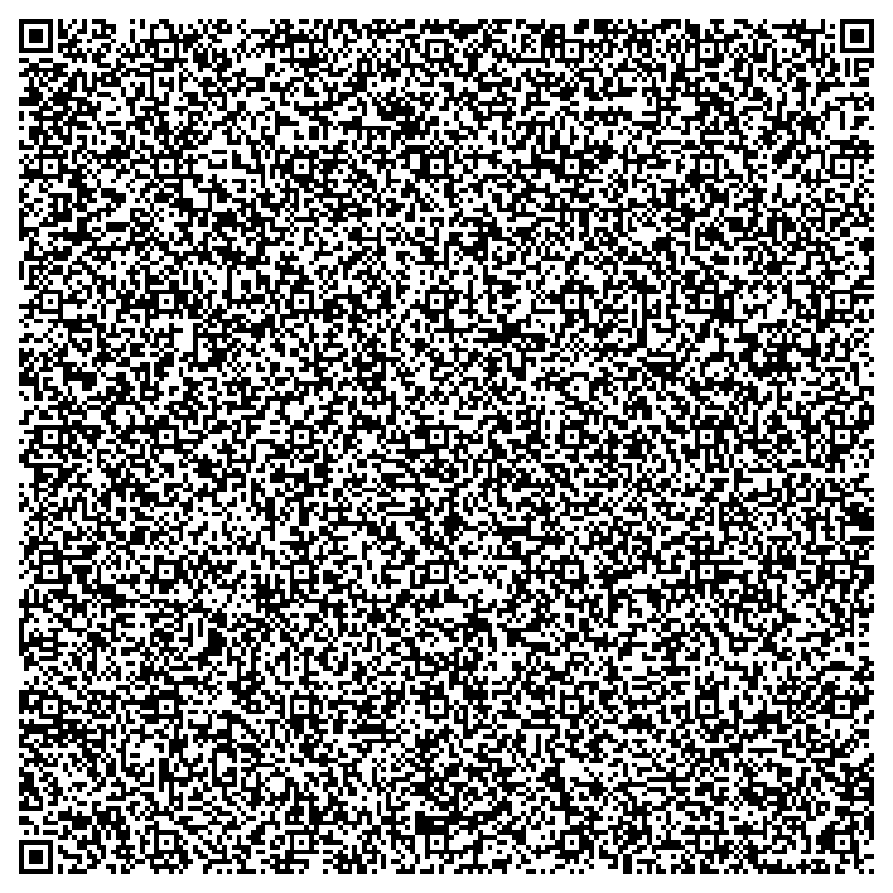

# QRay

The picture above is the browser build and the symbol holds the whole page inside one `data:` URI so a reader that follows one has nothing to download and no server sits in the middle. The assembly build is the other half of the project and it lives in `build/raycast_qr.png` and the program inside that one is 958 bytes of x86 assembly written for DOS. The whole game is one NASM file at `src/raycast.asm` and `nasm -f bin -d com_file` assembles it into `build/raycast.com` for the address DOS loads a `.com` image at which is 0x100 so the first byte of the file is the first instruction and the only three bytes in the whole program that spell an address the sine table at offset 478 the maze strip at offset 510 and the palette at offset 766 all resolve inside the image. Those 958 bytes pack down to 777 with the LZSS coder in `tools/lzss.py` and `build/raycast_qr.png` carries the packed bytes so 2176 bytes of room are left under the 2953 byte ceiling of a version 40 symbol at error correction level L. The encoder takes the smallest version that holds the payload and this payload lands on version 19 which is 93 modules on a side. `tools/verify_qr_rt.py` decodes the finished PNG and unpacks it and compares the bytes against `build/raycast.com` and `build.ps1` stops on the first step that reports a failure so a symbol that lost the program cannot be handed out quietly.

This is not DOOM and it is not a level from DOOM. No DOOM code is in the repository and no level file from any game is in it. The maze is 256 bytes carried inside the program itself one byte to a cell where 0x80 is a wall 0x00 is open floor and 0xC0 is an enemy. The name on the repository says what kind of game this is and nothing more.

## What the program does

The display is mode 13h at 320 by 200 with 256 colours and the program writes 64 colours into the DAC before the first frame. The view is 40 columns of 8 pixels and each column fires one ray and the columns run from 20 angle units left of the centre to 19 units right of it. The angle lives in a byte where 32 units are a right angle so the columns sit 2.8 degrees apart and the whole frame spans about 110 degrees. A ray marches one cell at a time until it reads a maze byte with bit 7 set and the distance it covered sets the wall height as 2048 divided by that distance capped at 198 rows and it sets the wall colour as the distance divided by 16 added to palette entry 18 which begins a 32 entry ramp running from 56 50 42 down to 22 20 17 so a near wall is the light end of the ramp and a far wall is the dark end. Every column corrects its own distance by the cosine of its angle which keeps the walls flat. The floor is palette entry 3 the brown at 50 28 16 and the ceiling is palette entry 1 which is black except for the single frame after a shot starts where the fire flag doubles as the ceiling colour and entry 7 at 36 36 36 becomes the muzzle flash.

The enemies share the maze array with the walls. Twelve of the 256 bytes are 0xC0 and the low two bits of each of those bytes count hits so three shots turn that byte into 0 and take one off the count of enemies left which starts at twelve. Only the centre column of the 40 can hit anything and only while the fire flag is up so aiming means putting an enemy down the middle of the screen. An enemy takes one step every 32 BIOS ticks toward the player when the next cell is open. The BIOS moves its tick counter 18.2 times a second and the loop waits for the next tick so the game runs at most 18.2 frames a second and a step lands about 1.8 seconds after the one before it. An enemy that reaches the player's cell fills the screen with palette entry 12 which is black one 23 pixel block at a time and then the level restarts and clearing all twelve restarts the level as well. The controls are the BIOS shift flags where left Ctrl turns left and left Alt turns right and left Shift walks forward four steps a frame and right Shift fires. There is no sound and no quit key and nothing is saved.

## The browser build

The same game is written a second time as a page for a browser because no phone runs a DOS binary. `src/game.js` is 3273 bytes and `game.html` is 3689 characters and the page carries the game inside itself with no fetch of any kind. The page deflates to 2168 bytes and then becomes a `data:` URI of 3804 characters of which 3469 are alphanumeric so those characters cost 5.5 bits apiece instead of 8 and the payload comes to 21816 bits of the 23648 bits a version 40 symbol at level L holds which leaves 229 bytes of room. The build deflates that page into a base32 string at 5 bits to a character and wraps the string in a page of its own that hands the bytes to the browser decompressor and writes the page it gets back in place and `build/web_qr.png` holds that wrapper so the symbol at the top of this page is the one that leads to the browser build.

The page draws 160 by 100 pixels scaled to fill the window with the canvas pixelated and a portrait window letterboxes instead so the game keeps its shape. Every load seeds the arena generator from the clock in milliseconds so two loads differ. The arena is 28 by 28 cells with a wall border and blocks are laid on a lattice of cells at 3 9 15 and 21 and a block is 3 to 5 cells across and one lattice cell in eight is left empty and one doorway is cut into a random side of every block. The player starts on one of six cells the lattice can never reach and six enemies stand at 2.5 14.5 and 26.5 across and 2.5 or 20.5 down which the lattice cannot reach either so all seven of them stand on open floor. Health starts at 100 and an enemy touch costs 6 and a touch cannot repeat inside the same 45 frame cycle so about three quarters of a second passes between two hits. A shot costs 15 frames and reaches 8 units and it lands when the direction to an enemy divided by the distance is above 0.8 which is a cone of about 37 degrees either side of the facing. An enemy further away than 1.1 units walks at the player at 0.01 units a frame. The pistol sprite is 11 by 12 at double size low in the middle of the screen and the health number and bar sit on the left in palette entry 8 the green at 70 190 70 which turns into entry 4 the blue at 45 55 205 below 30 health. An enemy behind a wall draws a 2 by 2 mark above itself in that same blue because the mark skips the depth test so nothing hidden stays hidden. A dead enemy is drawn flat in entry 0 the light gray at 232 232 232 and shrinks to nothing over about 24 frames. The loop runs every 16 milliseconds and writes WON when the last enemy falls and LOST when health reaches zero and pressing R or the space bar after either of those reloads the page. The arrow keys or WASD turn and walk and the space bar fires and a touch screen fires along its bottom fifth and walks with the left half which goes forward in the top half of that side and backwards below it and turns with the right half which goes left up to seven tenths of the width and right beyond that.

## Rebuilding

A rebuild is `powershell -File build.ps1` and it needs nasm and python on PATH with the qrcode pillow and zxing-cpp packages installed and `-AsmOnly` stops after the assembly symbol. The script assembles and packs and encodes then decodes the finished symbol back and compares the bytes and then builds the page and its symbol and it stops on the first step that reports a failure. Everything under `build/` comes back from the sources.

## Credits

The assembly engine started as cubicDoom by Oscar Toledo G. which is a raycaster that fits in a 512 byte boot sector under the 2 clause BSD licence. The ray loop and the one byte per maze cell layout come from that program and `src/raycast.asm` keeps his header. The art the browser build draws from came out of Freedoom under the 3 clause BSD licence and the digit shapes came from asm-doom by ummeii under MIT. Putting the game inside the image instead of behind a link follows backdooms under MIT.
